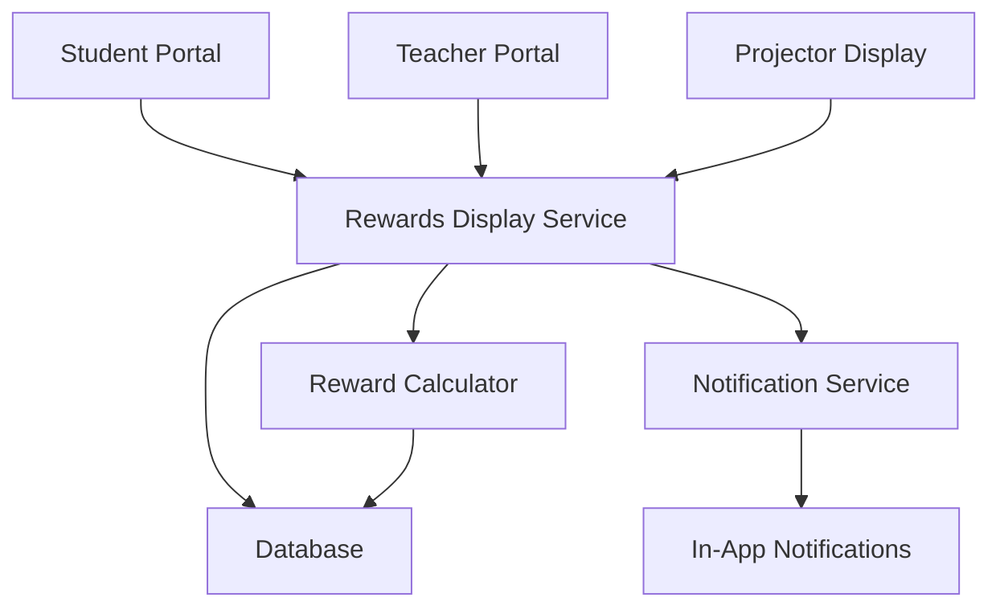

# Design Document - E-wallet Rewards System

## Overview

Sistem E-wallet Rewards adalah fitur yang menampilkan dan melacak reward berupa
saldo e-wallet untuk siswa SMK berdasarkan pencapaian akademik mereka. Sistem
ini berfungsi sebagai display dan tracking tool yang memungkinkan guru untuk
memberikan apresiasi uang tunai secara langsung di kelas berdasarkan pencapaian
yang ditampilkan di layar proyektor.

## Architecture

### High-Level Architecture



### System Components

1. **Rewards Display Service**: Core service untuk menampilkan dan melacak
   reward
2. **Reward Calculator**: Service untuk menghitung eligibilitas dan jumlah
   reward
3. **Projector Display**: Interface khusus untuk ditampilkan di proyektor kelas
4. **Teacher Portal**: Interface untuk guru melihat dan mengonfirmasi pemberian
   reward
5. **Notification Service**: Service untuk notifikasi in-app kepada siswa

## Components and Interfaces

### 1. Database Schema

#### Rewards Table

```sql
CREATE TABLE rewards (
    id UUID PRIMARY KEY DEFAULT gen_random_uuid(),
    student_id UUID REFERENCES students(id),
    reward_type VARCHAR(50) NOT NULL, -- 'leaderboard_rank', 'milestone'
    reward_criteria JSONB NOT NULL, -- {'rank': 1, 'period': '2024-01'}
    amount DECIMAL(10,2) NOT NULL,
    currency VARCHAR(3) DEFAULT 'IDR',
    status VARCHAR(20) DEFAULT 'pending', -- pending, available, processing, completed, failed
    earned_at TIMESTAMP WITH TIME ZONE DEFAULT NOW(),
    processed_at TIMESTAMP WITH TIME ZONE,
    created_at TIMESTAMP WITH TIME ZONE DEFAULT NOW(),
    updated_at TIMESTAMP WITH TIME ZONE DEFAULT NOW()
);
```

#### Reward Claims Table

```sql
CREATE TABLE reward_claims (
    id UUID PRIMARY KEY DEFAULT gen_random_uuid(),
    student_id UUID REFERENCES students(id),
    reward_id UUID REFERENCES rewards(id),
    claimed_by UUID REFERENCES users(id), -- Teacher who gave the reward
    claimed_at TIMESTAMP WITH TIME ZONE DEFAULT NOW(),
    notes TEXT, -- Optional notes from teacher
    created_at TIMESTAMP WITH TIME ZONE DEFAULT NOW()
);
```

#### Reward Settings Table

```sql
CREATE TABLE reward_settings (
    id UUID PRIMARY KEY DEFAULT gen_random_uuid(),
    setting_key VARCHAR(100) UNIQUE NOT NULL,
    setting_value JSONB NOT NULL,
    description TEXT,
    created_at TIMESTAMP WITH TIME ZONE DEFAULT NOW(),
    updated_at TIMESTAMP WITH TIME ZONE DEFAULT NOW()
);

-- Default settings
INSERT INTO reward_settings (setting_key, setting_value, description) VALUES
('leaderboard_rewards', '{"rank_1": 100000, "rank_2": 50000, "rank_3": 25000}', 'Reward amounts for leaderboard rankings'),
('milestone_rewards', '{"1000_points": 10000, "2500_points": 25000, "5000_points": 50000}', 'Reward amounts for point milestones'),
('withdrawal_minimum', '10000', 'Minimum amount for withdrawal'),
('evaluation_period', '"monthly"', 'Frequency of reward evaluation');
```

### 2. API Endpoints

#### Student Endpoints

```typescript
// Get student's reward summary
GET /api/rewards/summary
Response: {
  total_earned: number,
  total_claimed: number,
  pending_rewards: Reward[],
  recent_rewards: Reward[],
  unclaimed_rewards: Reward[]
}

// Get reward history
GET /api/rewards/history?page=1&limit=10
Response: {
  rewards: Reward[],
  pagination: PaginationInfo
}
```

#### Teacher Endpoints

```typescript
// Get class reward overview for projector display
GET /api/teacher/rewards/class-overview/:classId
Response: {
  top_performers: StudentReward[],
  recent_achievements: Achievement[],
  pending_rewards: Reward[]
}

// Mark reward as claimed (when giving cash)
POST /api/teacher/rewards/claim
Body: {
  reward_id: string,
  student_id: string,
  notes?: string
}

// Get projector display data
GET /api/teacher/rewards/projector-display/:classId
Response: {
  leaderboard: StudentRanking[],
  reward_winners: RewardWinner[],
  celebration_data: CelebrationData
}
```

#### Admin Endpoints

```typescript
// Get reward statistics
GET /api/admin/rewards/stats
Response: {
  total_distributed: number,
  total_claimed: number,
  pending_claims: number,
  top_earners: StudentReward[]
}

// Get eligible students for current period
GET /api/admin/rewards/eligible
Response: {
  students: EligibleStudent[],
  period: string,
  criteria: RewardCriteria
}

// Process reward distribution
POST /api/admin/rewards/distribute
Body: {
  period: string,
  dry_run?: boolean
}

// Update reward settings
PUT /api/admin/rewards/settings
Body: {
  setting_key: string,
  setting_value: any
}
```

### 3. Projector Display Service

````typescript
interface ProjectorDisplayData {
  class_name: string;
  period: string;
  leaderboard: StudentRanking[];
  reward_winners: RewardWinner[];
  celebration_mode: boolean;
}

interface StudentRanking {
  rank: number;
  student_name: string;
  total_points: number;
  reward_amount?: number;
  avatar_initials: string;
}

interface RewardWinner {
  student_name: string;
  reward_type: string;
  amount: number;
  achievement: string;
  celebration_icon: string;
}

class ProjectorDisplayService {
  async getClassRewardDisplay(classId: string): Promise<ProjectorDisplayData> {
    const classInfo = await this.getClassInfo(classId);
    const leaderboard = await this.getClassLeaderboard(classId);
    const recentRewards = await this.getRecentRewards(classId);
    
    return {
      class_name: classInfo.name,
      period: this.getCurrentPeriod(),
      leaderboard: this.formatLeaderboard(leaderboard),
      reward_winners: this.formatRewardWinners(recentRewards),
      celebration_mode: recentRewards.length > 0
    };
  }
  
  private formatLeaderboard(students: any[]): StudentRanking[] {
    return students.slice(0, 10).map((student, index) => ({
      rank: index + 1,
      student_name: student.name,
      total_points: student.total_points,
      reward_amount: this.getRewardAmount(index + 1),
      avatar_initials: this.getInitials(student.name)
    }));
  }
  
  private getRewardAmount(rank: number): number | undefined {
    const rewards = { 1: 100000, 2: 50000, 3: 25000 };
    return rewards[rank as keyof typeof rewards];
  }
}

### 4. Reward Calculator Service

```typescript
class RewardCalculator {
  async calculateLeaderboardRewards(period: string): Promise<StudentReward[]> {
    // Get leaderboard for each class
    const classes = await this.getActiveClasses();
    const rewards: StudentReward[] = [];
    
    for (const classInfo of classes) {
      const leaderboard = await this.getClassLeaderboard(classInfo.id, period);
      const settings = await this.getRewardSettings('leaderboard_rewards');
      
      // Award top 3 students in each class
      for (let i = 0; i < Math.min(3, leaderboard.length); i++) {
        const student = leaderboard[i];
        const rank = i + 1;
        const amount = settings[`rank_${rank}`];
        
        if (amount > 0) {
          rewards.push({
            student_id: student.id,
            reward_type: 'leaderboard_rank',
            reward_criteria: { rank, period, class_id: classInfo.id },
            amount
          });
        }
      }
    }
    
    return rewards;
  }
  
  async calculateMilestoneRewards(studentId: string): Promise<StudentReward[]> {
    const student = await this.getStudent(studentId);
    const milestones = await this.getRewardSettings('milestone_rewards');
    const earnedMilestones = await this.getEarnedMilestones(studentId);
    
    const rewards: StudentReward[] = [];
    
    for (const [milestone, amount] of Object.entries(milestones)) {
      const requiredPoints = parseInt(milestone.replace('_points', ''));
      
      if (student.total_points >= requiredPoints && 
          !earnedMilestones.includes(milestone)) {
        rewards.push({
          student_id: studentId,
          reward_type: 'milestone',
          reward_criteria: { milestone, required_points: requiredPoints },
          amount: amount as number
        });
      }
    }
    
    return rewards;
  }
}
````

## Data Models

### TypeScript Interfaces

```typescript
interface Reward {
    id: string;
    student_id: string;
    reward_type: "leaderboard_rank" | "milestone";
    reward_criteria: Record<string, any>;
    amount: number;
    currency: string;
    status: "pending" | "available" | "claimed";
    earned_at: Date;
    processed_at?: Date;
}

interface RewardClaim {
    id: string;
    student_id: string;
    reward_id: string;
    claimed_by: string; // Teacher ID
    claimed_at: Date;
    notes?: string;
}

interface RewardSummary {
    total_earned: number;
    total_claimed: number;
    pending_rewards: Reward[];
    recent_rewards: Reward[];
    unclaimed_rewards: Reward[];
}

interface ProjectorRewardDisplay {
    class_name: string;
    period: string;
    top_performers: {
        rank: number;
        student_name: string;
        points: number;
        reward_amount: number;
        celebration_emoji: string;
    }[];
    recent_winners: {
        student_name: string;
        achievement: string;
        amount: number;
        date: Date;
    }[];
}
```

## Error Handling

### Error Types

1. **Validation Errors**: Invalid input data atau missing required fields
2. **Business Logic Errors**: Reward sudah di-claim, student tidak eligible
3. **Database Errors**: Connection issues, constraint violations
4. **Authorization Errors**: Teacher tidak memiliki akses ke class tertentu

### Error Handling Strategy

```typescript
class RewardError extends Error {
    constructor(
        public code: string,
        public message: string,
        public details?: any,
    ) {
        super(message);
    }
}

// Error codes
const ERROR_CODES = {
    REWARD_ALREADY_CLAIMED: "REWARD_ALREADY_CLAIMED",
    STUDENT_NOT_ELIGIBLE: "STUDENT_NOT_ELIGIBLE",
    DUPLICATE_REWARD: "DUPLICATE_REWARD",
    UNAUTHORIZED_ACCESS: "UNAUTHORIZED_ACCESS",
    INVALID_PERIOD: "INVALID_PERIOD",
};
```

## Testing Strategy

### Unit Tests

- Reward calculation logic
- Projector display formatting
- Validation functions
- Error handling scenarios

### Integration Tests

- Database operations
- API endpoint functionality
- Notification service integration
- Teacher claim functionality

### End-to-End Tests

- Complete reward earning and claiming flow
- Projector display functionality
- Admin dashboard functionality
- Error scenarios and recovery

### Test Data Setup

```typescript
// Test fixtures
const testStudents = [
    {
        id: "student1",
        name: "John Doe",
        total_points: 1500,
        class_id: "class1",
    },
    {
        id: "student2",
        name: "Jane Smith",
        total_points: 1200,
        class_id: "class1",
    },
    {
        id: "student3",
        name: "Bob Johnson",
        total_points: 800,
        class_id: "class1",
    },
];

const testRewards = [
    {
        student_id: "student1",
        reward_type: "leaderboard_rank",
        amount: 100000,
        status: "available",
    },
];

const testProjectorDisplay = {
    class_name: "XII RPL 1",
    period: "January 2024",
    top_performers: [
        {
            rank: 1,
            student_name: "John Doe",
            points: 1500,
            reward_amount: 100000,
            celebration_emoji: "🥇",
        },
        {
            rank: 2,
            student_name: "Jane Smith",
            points: 1200,
            reward_amount: 50000,
            celebration_emoji: "🥈",
        },
        {
            rank: 3,
            student_name: "Bob Johnson",
            points: 800,
            reward_amount: 25000,
            celebration_emoji: "🥉",
        },
    ],
};
```

## Security Considerations

### Data Protection

- Use HTTPS for all API communications
- Log all reward claims for audit trail
- Secure storage of reward data

### Access Control

- Role-based access control (student, teacher, admin)
- Students can only access their own reward data
- Teachers can only access their assigned classes
- Admins have full system access

### Fraud Prevention

- Prevent duplicate reward claims
- Audit trail for all reward distributions and claims
- Teacher verification required for reward claims

## Performance Considerations

### Scalability

- Use database indexing for frequently queried fields
- Implement caching for reward settings and calculations
- Use background jobs for reward distribution
- Implement pagination for large data sets

### Monitoring

- Track API response times
- Monitor reward claim success rates
- Alert on system errors
- Dashboard for reward distribution metrics

## Deployment Strategy

### Database Migration

- Create new tables with proper constraints
- Seed initial reward settings
- Create necessary indexes
- Set up backup and recovery procedures

### Feature Rollout

1. Deploy backend services and database changes
2. Enable projector display for teachers
3. Enable student reward viewing
4. Enable reward claiming functionality
5. Monitor system performance and user feedback

## UI Components

### Projector Display Components

- **Leaderboard Display**: Large, colorful display showing top 10 students with
  their points and potential rewards
- **Celebration Mode**: Animated display when rewards are being distributed
- **E-wallet Logos**: Display DANA, GoPay, OVO logos to represent the cash
  equivalent
- **Real-time Updates**: Live updates as teachers mark rewards as claimed

### Student Portal Components

#### Navigation Integration

- **Sidebar Menu**: Add "Rewards" menu item below "Achievements" in
  StudentSidebar component
- **Route**: `/student/rewards` - New route in StudentPortal component
- **Icon**: Money/wallet icon to represent rewards

#### Rewards Page Layout

- **Rewards Page**: New dedicated page accessible from sidebar menu (below
  Achievements)
  - **Header Section**: "Your Rewards" with motivational subtitle
  - **Reward Summary Cards**:
    - Total Earned (with DANA logo)
    - Pending Rewards (with GoPay logo)
    - Claimed Rewards (with OVO logo)
  - **Current Rank Card**: Show class rank with potential reward amount
  - **Next Reward Target**: Progress bar showing points needed for next
    milestone
  - **E-wallet Visual**: Large, attractive display with clear reward structure
    - **DANA Logo** with motivational text below: "Raih point tertinggi untuk
      mendapatkan rewards"
    - **GoPay Logo** with large, prominent reward amounts:
      - **"100K"** (very large, bold text for Rank 1 - primary motivation)
      - **"50K"** (large text for Rank 2)
      - **"25K"** (medium text for Rank 3)
    - **Visual Hierarchy**: 100K text should be significantly larger than others
      to create strong motivation
    - **Color Coding**: Use green/gold colors for reward amounts to signify
      money/success
  - **Motivational Elements**:
    - Celebration animations for new rewards
    - "Keep Learning!" motivational messages
    - Progress indicators and achievement streaks
    - **Call-to-Action**: "Tingkatkan ranking untuk rewards lebih besar!"
  - **Quick Actions**:
    - "View Leaderboard" button
    - "Check Achievements" button
- **Reward History Section**: Timeline of all rewards received with claim status
- **Achievement Integration**: Link between achievements and reward eligibility

### Teacher Portal Components

- **Class Reward Overview**: Summary of students eligible for rewards
- **Claim Interface**: Simple interface to mark rewards as given
- **Projector Control**: Button to launch projector display mode
